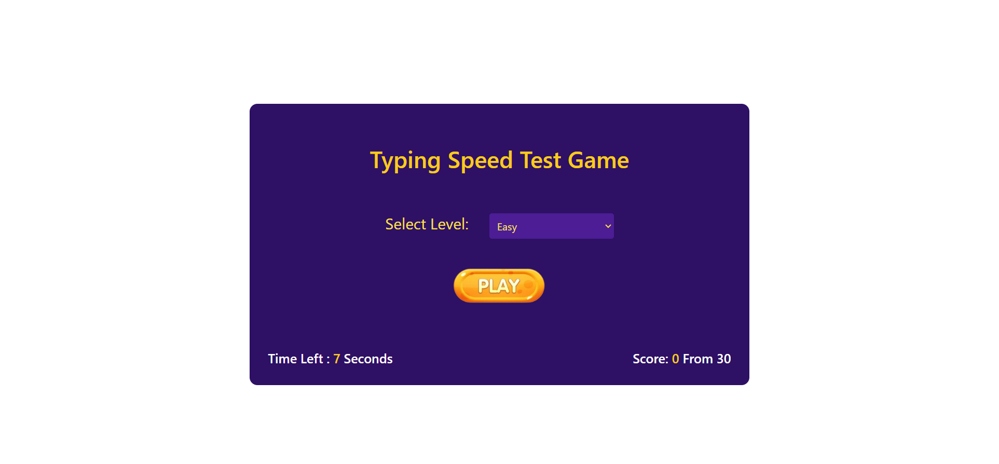
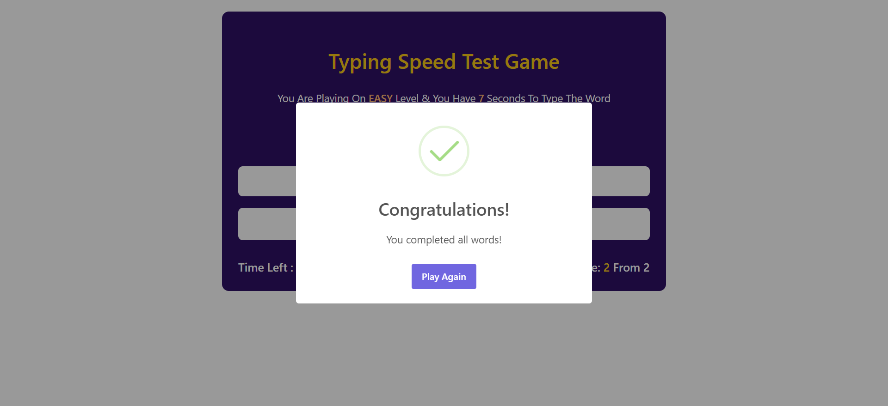
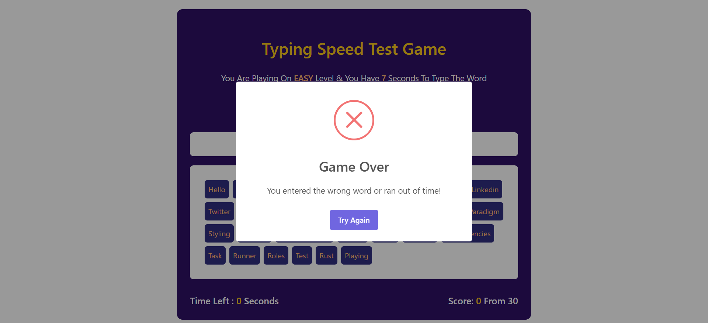

# Typing Speed Test Game

This project is a Typing Speed Test Game where players can select a difficulty level, then try to type random words as fast as possible before the time runs out. The game dynamically updates based on the difficulty level and displays real-time feedback on score and time.

## Features

- Three difficulty levels: Easy, Medium, and Hard.
- Randomly generated words from a predefined list.
- Real-time countdown timer.
- Tracks score and total words left.
- Shows upcoming words.
- Responsive design.
- SweetAlert popups for success and failure.
- Ability to restart the game after completion or failure.

## Technologies Used

- HTML for the structure.
- CSS (Tailwind CSS) for styling and responsive design.
- JavaScript for game logic.
- SweetAlert2 for beautiful, customizable alert dialogs.
- LocalStorage for saving and retrieving game levels

## Live Demo :

[]
